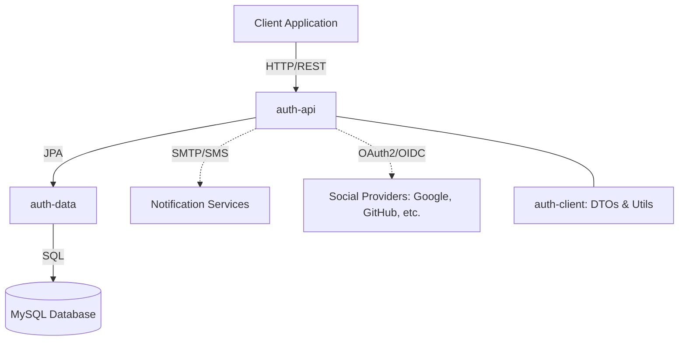

# Albedo Auth Service Architecture

## High-Level Architecture Diagram



## Technology Stack

The Albedo Auth service utilizes the following technologies:

- **Java 21**: Core programming language.
- **Spring Boot 3.3.x**: Primary framework.
- **Spring Security & Spring Authorization Server**: For authentication and OAuth2/OIDC.
- **MySQL 8.x**: Relational database for persistence.
- **Hibernate / JPA**: Object-Relational Mapping.
- **Gradle**: Build and dependency management.
- **Lombok**: To reduce boilerplate code.
- **ModelMapper**: For DTO-to-Entity mapping.

## Project Structure

The Albedo Auth service is organized as a multi-module Gradle project:

1. **`auth-client`**
    - Shared module containing DTOs (`UserDto`, `PasswordChangeDto`), custom exceptions, and common utilities (`PasswordTools`).
    - Intended to be used as a dependency by other services that need to interact with Albedo Auth.

2. **`auth-data`**
    - Data access layer containing JPA entities (`User`, `UserRole`, `PasswordChangeRequest`) and Spring Data repositories.
    - Handles persistence logic and database schema management.

3. **`auth-api`**
    - Core service implementation exposing REST endpoints.
    - Configures Spring Security and the OAuth2 Authorization Server.
    - Implements business logic for user registration, password management, and notifications.

## Key Service Flows

### 1. User Authentication (Resource Owner Password Credentials)
- Client sends user credentials to `/oauth2/token`.
- `auth-api` validates credentials against `auth-data`.
- On success, `auth-api` generates and signs a JWT access token.

### 2. User Registration
- Client sends registration details to `/public/user/register`.
- `auth-api` hashes the password and saves a new `User` entity via `auth-data`.
- Default roles are assigned to the new user.

### 3. Password Reset
- User requests a reset via `/public/user/{username}/reset-password`.
- `auth-api` generates a secure token and saves a `PasswordChangeRequest`.
- A notification is sent via the active provider (e.g., Email, SMS, or Log).
- User completes the reset by providing a new password and the token to `/public/change-password/`.

## Controllers & Endpoints

The authenticated API surface is intentionally small and composed of:

1. **UserController (`/user`)**
    - `GET /user/{username}` – Retrieve a user profile (requires authentication).

2. **PublicController (`/public`)**
    - `POST /public/user/register` – Self-service registration.
    - `GET /public/user/{username}/reset-password` – Initiate password reset (sends the encrypted token via email).
    - `POST /public/change-password/` – Finalise password change with the encrypted token.

3. **OAuth 2.0 Token Endpoint (`/oauth2/token`)**
    - Provided by Spring Authorization Server; supports `password`, `client_credentials`,
      `refresh_token`, and `authorization_code` grant types for issuing JWT access tokens.
    - Client authentication uses HTTP Basic or `client_id`/`client_secret` request parameters.

# Albedo Auth Service - Build and Usage Instructions

## Instructions for Use

1. **Clone the Repository**: Clone the repository to your local machine.
    ```bash
    git clone <repository-url>
    cd albedo-auth
    ```

2. **Build the Project**: Use Gradle to build the project.
    ```bash
    ./gradlew build
    ```

3. **Run the Service**: Start the service using Gradle.
    ```bash
    ./gradlew bootRun
    ```

4. **Access the Endpoints**: Use a tool like Postman or cURL to interact with the API endpoints provided by the
   controllers.

## Additional Notes

- Ensure you have Java and Gradle installed on your machine.
- Refer to the high-level architecture diagram to understand the interaction between different components.
